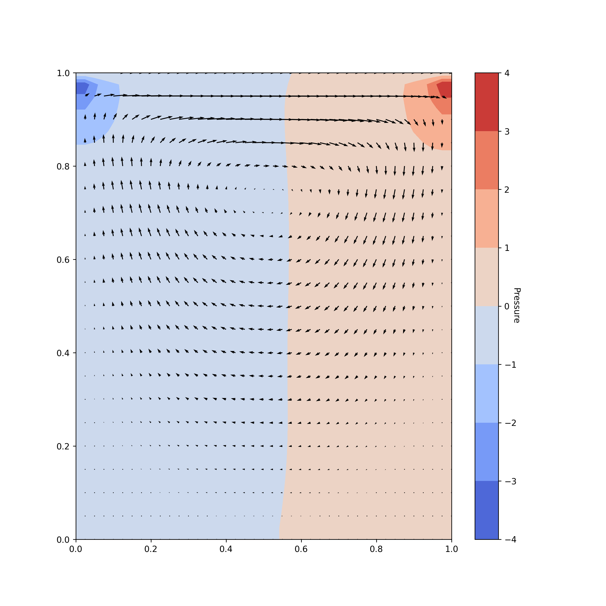
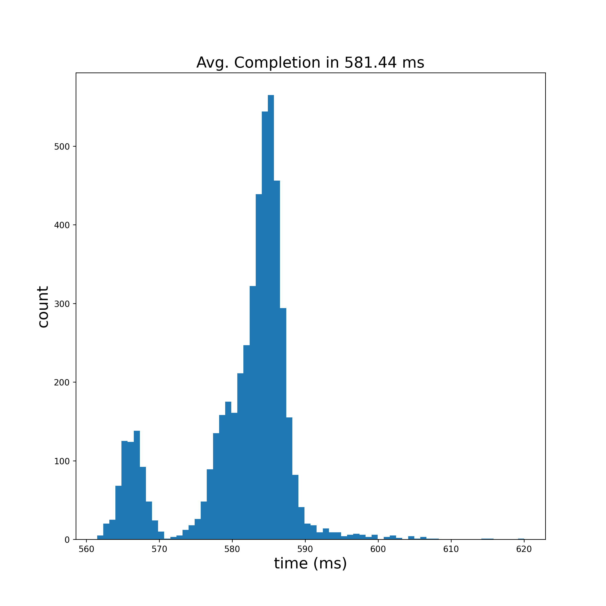
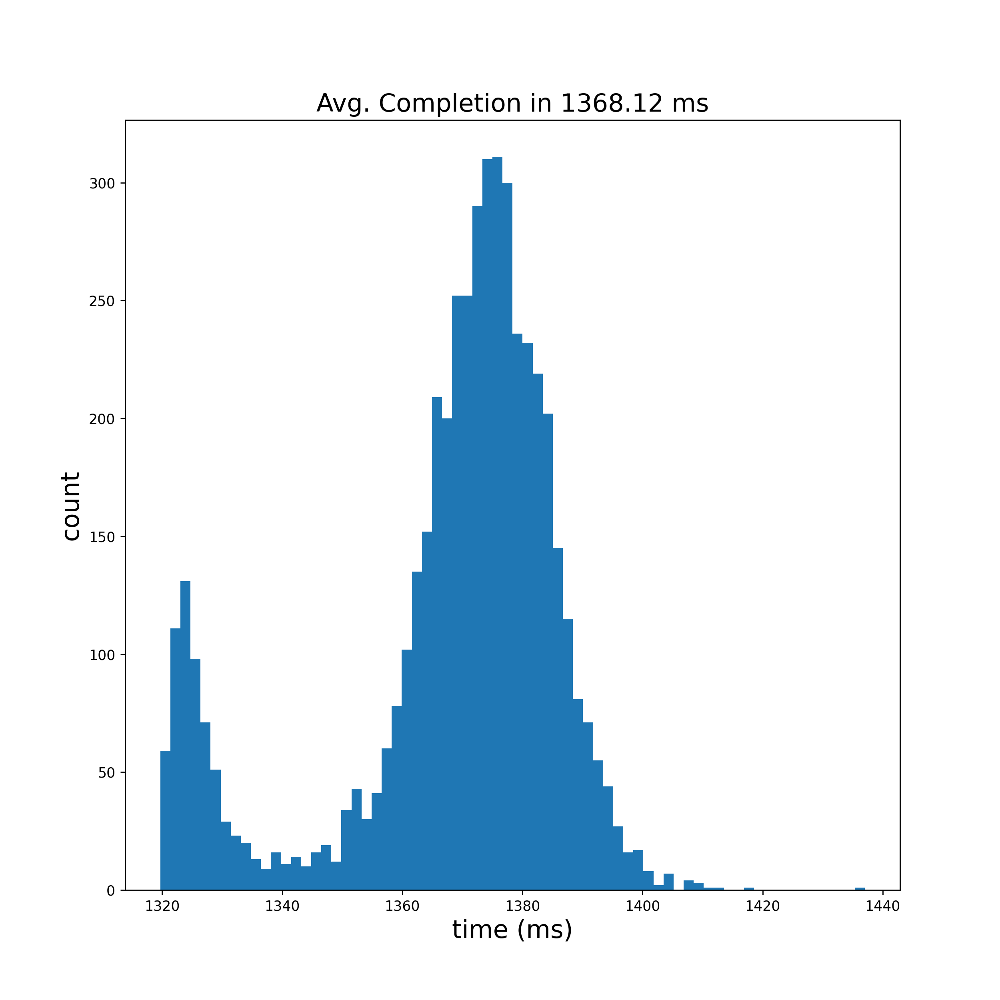

# Fluid Simulation
Author: Daniel J. Vickers

## About

This repository has been created for me to explore fluid simulation, as an attempt to move towards magnetohydro dynamics simulations. I have opted to start by solving the incompressible Navier-Stokes equations for fluid flow before adding the complexity of electromagnetism. This is also an opportunity for me to demonstrate an ability to write software in Python, C++, and CUDA.

The goal of this project overall is easy-to-read python code that will allow someone to properly learn Navier-Stokes, a C++/CUDA shared object library with python bindings for use in personal projects, and an exploration of benchmarks for performance of the various implementations fo the library.

All of the python code is written to leverage performance from numpy. This is intended to be the unit test for the higher-performance implementations of the simulation and a performance baseline.

The C++ code is meant to be a serial implementation of Navier-Stokes.

The CUDA code is a large-scale parallel implementation of Navier-Stokes. I am leaving several versions of the simulation, and the data presented here is generated using an NVIDIA RTX 2080 Super, and will not likely not yield similar performance on your machine.

## Python

The most-basic implementation is a python version that leverages linear algebra in numpy. Because we will be implementing the Cpp and CUDA versions raw (without external libraries), the python implementation is quite optimial.

### Citations

The Python implementation is based upon an implementation that I found here: https://github.com/Ceyron/machine-learning-and-simulation/blob/main/english/simulation_scripts/lid_driven_cavity_python_simple.py
The results of that solver are captured in a youtube video here: https://www.youtube.com/watch?v=BQLvNLgMTQE
I want it to be clear that this Python code is largely influenced by the contents of the repository I just provided. The C++ and CUDA implementations are my own.
It is easy to find plentiful descriptions of Navier-Stokes online. I will link here the wiki page for the equations: https://en.wikipedia.org/wiki/Navier%E2%80%93Stokes_equations

### Code Explained

We will be tracking the pressure and velocity (stored as two patrices: u and v) of the fluid in the grid. To start, we instatiate our mesh grid:

```python
# define the x and y values
element_length = domain_size / (num_elements - 1)
x = np.linspace(0., domain_size, num_elements)
y = np.linspace(0., domain_size, num_elements)

# create the vector fields
X, Y = np.meshgrid(x, y)
u_previous = np.zeros_like(X)
v_previous = np.zeros_like(X)
p_previous = np.zeros_like(X)
```

We need the ability to compute the central difference and laplacian on this grid. For that, we define those in functions:

```python
def central_difference_x(field, element_length):
    diff = np.zeros_like(field)
    diff[1:-1, 1:-1] = (field[1:-1, 2:] - field[1:-1, :-2]) / (2. * element_length)
    return diff


def central_difference_y(field, element_length):
    diff = np.zeros_like(field)
    diff[1:-1, 1:-1] = (field[2:, 1:-1] - field[:-2, 1:-1]) / (2. * element_length)
    return diff


def laplace(field, element_length):
    diff = np.zeros_like(field)
    diff[1:-1, 1:-1] = field[1:-1, :-2] + field[:-2, 1:-1] - 4 * field[1:-1, 1:-1] + field[1:-1, 2:] + field[2:, 1:-1]
    diff = diff / (element_length ** 2)
    return diff
```

We can then compute these for our velocities via the Couchy momentum equation:

```python
# get tentative velocity
d_u_previous_d_x = central_difference_x(u_previous, element_length)
d_u_previous_d_y = central_difference_y(u_previous, element_length)
d_v_previous_d_x = central_difference_x(v_previous, element_length)
d_v_previous_d_y = central_difference_y(v_previous, element_length)
u_previous_laplacian = laplace(u_previous, element_length)
v_previous_laplacian = laplace(v_previous, element_length)
```

This gives us some differential information that we can use to plug into the Navier-Stokes equation for velocity and then get a tenative estimate of the new state that we will use in the poison steps:

```python
du_dt = kinematic_viscosity * u_previous_laplacian - u_previous * d_u_previous_d_x - v_previous * d_u_previous_d_y
dv_dt = kinematic_viscosity * v_previous_laplacian - u_previous * d_v_previous_d_x - v_previous * d_v_previous_d_y
u_tentative = u_previous + time_step * du_dt
v_tentative = v_previous + time_step * dv_dt

du_tentative_dx = central_difference_x(u_tentative, element_length)
dv_tentative_dy = central_difference_y(v_tentative, element_length)
```

We then use these velocities to solve the pressure poisson equation. We will perform an iterative number of poison steps to allow the fluid to settle over multiple steps.

```python
# solve pressure poisson equation
right_hand_side = (density / time_step) * (du_tentative_dx + dv_tentative_dy)
p_next = np.zeros_like(p_previous)
for j in range(num_poisson_iterations):
    p_next[1:-1, 1:-1] = ((right_hand_side[1:-1, 1:-1] * element_length**2) - (
        p_previous[1:-1, :-2] + p_previous[1:-1, 2:] + p_previous[:-2, 1:-1] + p_previous[2:, 1:-1]
    )) * -0.25

    p_next[:, -1] = p_next[:, -2]
    p_next[:, 0] = p_next[:, 1]
    p_next[0, :] = p_next[1, :]
    p_next[-1:, :] = 0.
    p_previous = p_next
```

We compute the pressure so that we can use the next equation to update the velocity

```python
dp_next_dx = central_difference_x(p_previous, element_length)
dp_next_dy = central_difference_y(p_previous, element_length)

# correct velocities
u_next = u_tentative - (time_step / density) * dp_next_dx
v_next = v_tentative - (time_step / density) * dp_next_dy
```

Finally we apply our boundary coniditions. Since the python version is only made for an open box, we set the left, right, and bottom velocities to zero. We also set the top velocity to a constant.

Once we have our final velocities, we step forward in time.

```python
# apply the boundary conditions
u_next[0, :] = 0.  # bottom
u_next[-1, :] = top_velocity  # top
u_next[:, 0] = 0.  # left
u_next[:, -1] = 0.  # right
v_next[0, :] = 0.
v_next[-1, :] = 0.
v_next[:, 0] = 0.
v_next[:, -1] = 0.

# step forward in time
u_previous = u_next
v_previous = v_next
p_previous = p_next
```

### Results

The result of the sim is the quiver plot below that captures the fluid velocity and pressure.



I then tested the performance of our Navier-Stokes solver. The parameters here are those that match all solutions in this repo:
- 41x41 bins in our grid
- 1000 time steps forward
- 50 poison steps to let the fluid settle

The results of 5000 time trials for the Python version is shown below.



## C++

### Code Explained

The best explanation of the C++ implementation can be found in the readme for the cpp directory. The primary note is that this code is a direct port of the python code. It was also templated for floating point and double precisions.

### Results

The timing performance of each template of the code is similar enough to only present one iteration. We can view the single-point precision performance on my machine below:



I we see that we have reduced the average completion time by about a factor of x7 performance improvement moving to C++. This is significant, as I am now able to gather this same data on the order of minutes as opposed to about an hour. Due to the sheer amount of compute being performed before visualization, we would expect the CUDA implementation to yield the most-significant improvement, which we explore in the next section.
