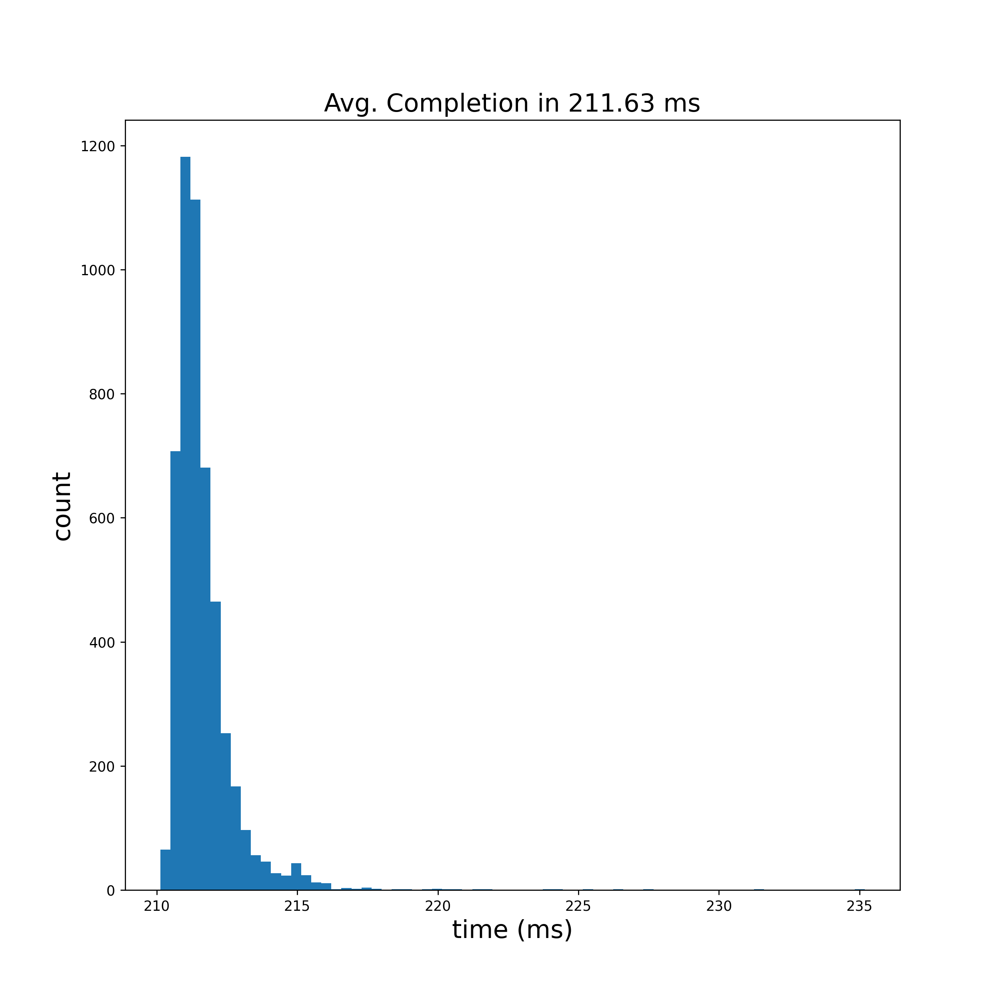
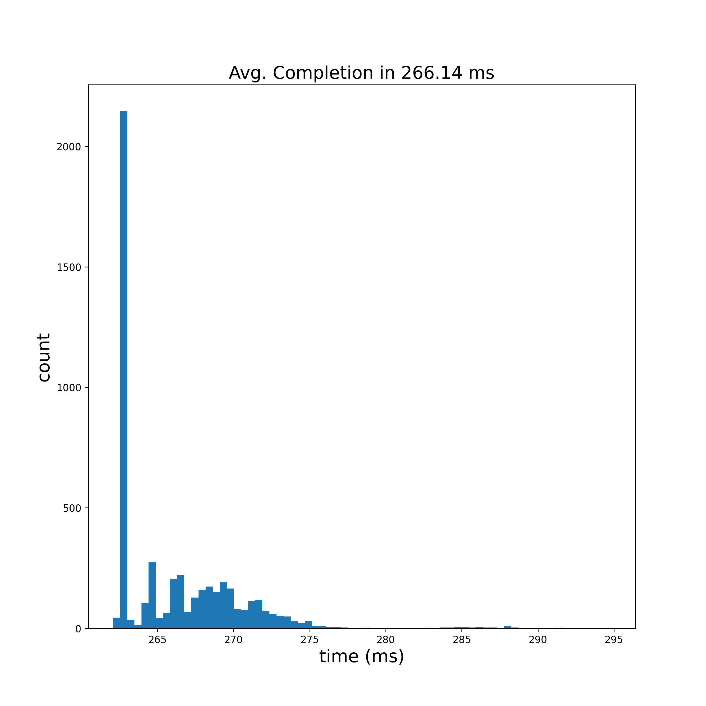

# Fluid Simulation
Author: Daniel J. Vickers

## About

This repository has been created for me to explore fluid simulation, as an attempt to move towards magnetohydro dynamics simulations. I have opted to start by solving the incompressible Navier-Stokes equations for fluid flow before adding the complexity of electromagnetism. This is also an opportunity for me to demonstrate an ability to write software in Python, C++, and CUDA.

The goal of this project overall is easy-to-read python code that will allow someone to properly learn Navier-Stokes, a C++/CUDA shared object library with python bindings for use in personal projects, and an exploration of benchmarks for performance of the various implementations fo the library.

All of the python code is written to leverage performance from numpy. This is intended to be the unit test for the higher-performance implementations of the simulation and a performance baseline.

The C++ code is meant to be a serial implementation of Navier-Stokes.

The CUDA code is a large-scale parallel implementation of Navier-Stokes. I am leaving several versions of the simulation, and the data presented here is generated using an NVIDIA RTX 2080 Super, and will not likely not yield similar performance on your machine.

## Citations

The Python implementation is based upon an implementation that I found here: https://github.com/Ceyron/machine-learning-and-simulation/blob/main/english/simulation_scripts/lid_driven_cavity_python_simple.py
The results of that solver are captured in a youtube video here: https://www.youtube.com/watch?v=BQLvNLgMTQE
I want it to be clear that this Python code is largely influenced by the contents of the repository I just provided. The C++ and CUDA implementations are my own.
It is easy to find plentiful descriptions of Navier-Stokes online. I will link here the wiki page for the equations: https://en.wikipedia.org/wiki/Navier%E2%80%93Stokes_equations
"GPU Gems", published by NVIDIA, is one of the best resources available for physics-GPU compute optimization. I found (only after making an initial immplemtation of Navier-Stokes) that GPU Gems volume 1 has already published an article about a Navier-Stokes solver: https://developer.nvidia.com/gpugems/gpugems/part-vi-beyond-triangles/chapter-38-fast-fluid-dynamics-simulation-gpu

## Python

The most-basic implementation is a python version that leverages linear algebra in numpy. Because we will be implementing the Cpp and CUDA versions raw (without external libraries), the python implementation is quite optimial.

#### Code Explained

We will be tracking the pressure and velocity (stored as two patrices: u and v) of the fluid in the grid. To start, we instatiate our mesh grid:

```python
# define the x and y values
element_length = domain_size / (num_elements - 1)
x = np.linspace(0., domain_size, num_elements)
y = np.linspace(0., domain_size, num_elements)

# create the vector fields
X, Y = np.meshgrid(x, y)
u_previous = np.zeros_like(X)
v_previous = np.zeros_like(X)
p_previous = np.zeros_like(X)
```

We need the ability to compute the central difference and laplacian on this grid. For that, we define those in functions:

```python
def central_difference_x(field, element_length):
    diff = np.zeros_like(field)
    diff[1:-1, 1:-1] = (field[1:-1, 2:] - field[1:-1, :-2]) / (2. * element_length)
    return diff


def central_difference_y(field, element_length):
    diff = np.zeros_like(field)
    diff[1:-1, 1:-1] = (field[2:, 1:-1] - field[:-2, 1:-1]) / (2. * element_length)
    return diff


def laplace(field, element_length):
    diff = np.zeros_like(field)
    diff[1:-1, 1:-1] = field[1:-1, :-2] + field[:-2, 1:-1] - 4 * field[1:-1, 1:-1] + field[1:-1, 2:] + field[2:, 1:-1]
    diff = diff / (element_length ** 2)
    return diff
```

We can then compute these for our velocities via the Couchy momentum equation:

```python
# get tentative velocity
d_u_previous_d_x = central_difference_x(u_previous, element_length)
d_u_previous_d_y = central_difference_y(u_previous, element_length)
d_v_previous_d_x = central_difference_x(v_previous, element_length)
d_v_previous_d_y = central_difference_y(v_previous, element_length)
u_previous_laplacian = laplace(u_previous, element_length)
v_previous_laplacian = laplace(v_previous, element_length)
```

This gives us some differential information that we can use to plug into the Navier-Stokes equation for velocity and then get a tenative estimate of the new state that we will use in the poison steps:

```python
du_dt = kinematic_viscosity * u_previous_laplacian - u_previous * d_u_previous_d_x - v_previous * d_u_previous_d_y
dv_dt = kinematic_viscosity * v_previous_laplacian - u_previous * d_v_previous_d_x - v_previous * d_v_previous_d_y
u_tentative = u_previous + time_step * du_dt
v_tentative = v_previous + time_step * dv_dt

du_tentative_dx = central_difference_x(u_tentative, element_length)
dv_tentative_dy = central_difference_y(v_tentative, element_length)
```

We then use these velocities to solve the pressure poisson equation. We will perform an iterative number of poison steps to allow the fluid to settle over multiple steps.

```python
# solve pressure poisson equation
right_hand_side = (density / time_step) * (du_tentative_dx + dv_tentative_dy)
p_next = np.zeros_like(p_previous)
for j in range(num_poisson_iterations):
    p_next[1:-1, 1:-1] = ((right_hand_side[1:-1, 1:-1] * element_length**2) - (
        p_previous[1:-1, :-2] + p_previous[1:-1, 2:] + p_previous[:-2, 1:-1] + p_previous[2:, 1:-1]
    )) * -0.25

    p_next[:, -1] = p_next[:, -2]
    p_next[:, 0] = p_next[:, 1]
    p_next[0, :] = p_next[1, :]
    p_next[-1:, :] = 0.
    p_previous = p_next
```

We compute the pressure so that we can use the next equation to update the velocity

```python
dp_next_dx = central_difference_x(p_previous, element_length)
dp_next_dy = central_difference_y(p_previous, element_length)

# correct velocities
u_next = u_tentative - (time_step / density) * dp_next_dx
v_next = v_tentative - (time_step / density) * dp_next_dy
```

Finally we apply our boundary coniditions. Since the python version is only made for an open box, we set the left, right, and bottom velocities to zero. We also set the top velocity to a constant.

Once we have our final velocities, we step forward in time.

```python
# apply the boundary conditions
u_next[0, :] = 0.  # bottom
u_next[-1, :] = top_velocity  # top
u_next[:, 0] = 0.  # left
u_next[:, -1] = 0.  # right
v_next[0, :] = 0.
v_next[-1, :] = 0.
v_next[:, 0] = 0.
v_next[:, -1] = 0.

# step forward in time
u_previous = u_next
v_previous = v_next
p_previous = p_next
```

#### Results

The result of the sim is the quiver plot below that captures the fluid velocity and pressure.


I then tested the performance of our Navier-Stokes solver. The parameters here are those that match all solutions in this repo:
- 41x41 bins in our grid
- 1000 time steps forward
- 50 poison steps to let the fluid settle
- 5000 time trials

The results of 5000 time trials for the Python version is shown below.


In all, this code is capable of performing small simulations and providing reasonable results. Later after optimiing performance, I will want to gather benchmarks on a much more stressing case. For that, I will want to gather data using the following parameters:
- 1000x1000 bins in our grid
- 1000 time steps forward
- 50 poison steps to let the fluid settle
- 20 time trials

So that we can gather a fair metric of comparison, I will also present performance metrics for this time trial as well:


**...But can it go faster?**

## C++

### Serial Implementation
#### Code Explained

For the C++ implementation, we first create a templated class that stores useful data of the simulation, and has useful getters and setters. All of the variables for each cell to make the simulation go fast are given in `fluid_cpp/cpp/NavierStokesCell.h` as:

```c++
template <typename T>
struct NavierStokesCell {
    // the x velcoity (u), y velocity (v), and pressure (p)
    T u = 0.;
    T v = 0.;
    T p = 0.;

    // some values saved in the cell during computation
    T du_dx = 0.;
    T du_dy = 0.;
    T dv_dx = 0.;
    T dv_dy = 0.;
    T u_laplacian = 0.;
    T v_laplacian = 0.;
    T du_dt = 0.;
    T dv_dt = 0.;
    T right_hand_size = 0.;

    // placeholder for the updated values of the sim
    T u_next = 0.;
    T v_next = 0.;
    T p_next = 0.;
    T du_next_dx = 0.;
    T dv_next_dy = 0.;
    T dp_dx = 0.;
    T dp_dy = 0.;

    // boundary conditions (BCs). The set bool tells us if it has been set
    T u_boundary = 0.;
    T v_boundary = 0.;
    T p_boundary = 0.;
    bool u_boundary_set = false;
    bool v_boundary_set = false;
    bool p_boundary_set = false;
};
```

Notice that I am keeping track of some `da_next_db` values because it allows us to perform some computation without iterating through an entire loop again. I then instantiate our deminsion space in the `NavierStokesSolver()` object constructor, which has a private variable of `cells` to hold the parameters. The code for instantiation can be found in `fluid_cpp/cpp/NavierStokesSolver.cpp` file as:

```c++
this->cells = new NavierStokesCell<T>*[box_dim_x];
for (int x = 0; x < box_dim_x; x++) {
    this->cells[x] = new NavierStokesCell<T>[box_dim_y];
}
```

There is a good bit of code here, but the easiest way to show the steps of the computation is to show the `safeSolve()` method, which is a method template with each calculation being done in series. Inside each method is a pair of nested `for` loops, which iterate over each cell in the space. It turns out we can reduce this to only 4 pairs of loops, which is in the `solve()` method, not shown here. Below is the code for `safeSolve()`:

```c++
template <class T>
void SerialNavierStokes<T>::safeSolve() {
    // loop over each time step
    for (int i = 0; i < this->num_iterations; i++) {
        // compute useful derivatives
        this->computeCentralDifference();
        this->computeLaplacian();
        this->computeTimeDerivitive();

        // take a tenative step forward in time
        this->takeTimeStep();
        this->computeNextCentralDifference(); // recompute the central difference
        this->computeRightHandSide();

        // take a series of poisson steps to approximate the pressure in each cell
        for (int j = 0; j < this->num_poisson_iterations; j++) {
            // compute the Poisson step, enforce BCs, and enforce the pressure
            this->computePoissonStepApproximation();
            this->enforcePressureBoundaryConditions();
            this->updatePressure();
        }

        // get the pressure central difference, correct the u and v values, and enforce BCs
        this->computePressureCentralDifference();
        this->correctVelocityEstimates();
        this->enforceVelocityBoundaryConditions();
    }
}
```

When we are ready, we call the code by creating a `SerialNavierStokes` object, setting all of the parameters, establishing boundary conditions, and running the `solve()` method:

```c++
// set up the solver
int num_x_bins = 41;
int num_y_bins = 41;
float width = 1.0;
float height = 1.0;
SerialNavierStokes<float> solver(num_x_bins, num_y_bins, width, height);

// entire specific constants of the simulation
solver.density = 1.0;
solver.kinematic_viscosity = 0.1;
solver.num_iterations = 1000;
solver.num_poisson_iterations = 50;
solver.time_step = 0.001;
solver.stability_safety_factor = 0.5;

// establish boundary conditions
for (int x = 0; x < num_x_bins; x++) {
    solver.setUBoundaryCondition(x, 0, 0.);  // no flow inside of the floor
    solver.setVBoundaryCondition(x, 0, 0.);  // no flow into the floor
    solver.setUBoundaryCondition(x, num_y_bins - 1, 1.);  // water flowing to the right on top
    solver.setVBoundaryCondition(x, num_y_bins - 1, 0.);  // no flow into the top
    solver.setPBoundaryCondition(x, num_y_bins - 1, 0.);  // no pressure at the top
}
for (int y = 1; y < num_y_bins - 1; y++) {
    solver.setUBoundaryCondition(0, y, 0.);  // no flow into of the left wall
    solver.setVBoundaryCondition(0, y, 0.);  // no flow inside the left wall
    solver.setUBoundaryCondition(num_x_bins - 1, y, 0.);  // no floow into the right wall
    solver.setVBoundaryCondition(num_x_bins - 1, y, 0.);  // no flow inside the right wall
}

// Solve and retrieve the solution
solver.solve();
```

#### Results

For perforamnce benchmarks, I am going to We can view the single-point precision performance on my machine below:



I we see that the C++ version has imporved performance by about a factor of 2.5x. That is a nice performance gain in our small case. I also ran in our larger stressing case and recorded the following results:


**...But can it go even faster?**

### Threaded Implementation

#### Code Explained

The most-obvious next step is to multi-thread the code. There are a few problems with this that we will need to tackle. The first is that we want to keep the number of thread creations/destructions to a minimal, as that can hurt performance. For reference, I did try to launch a new string of threads for each function call, but the result was that our execution time shot up to over 10 seconds for this simple test case. This leads me to our first point, which is we are only threading the solve function. This was done by converting the solve function into something that can be threaded, and then writing a thin wrapper around that which launches and joins our threads:

```c++
template <class T>
void ThreadedNavierStokes<T>::solve() {
    for (int t = 0; t < THREADED_GRID_SIZE; t++) {
        // begin a thread to work on the unified time step approximation functions
        this->worker_threads[t] = std::thread(&ThreadedNavierStokes::solveThread, this, t);
    }
    for (int t = 0; t < THREADED_GRID_SIZE; t++) {
        // join all of the worker threads when they are complete
        this->worker_threads[t].join();
    }
}
```

This will launch a number of threads equal to `THREADED_GRID_SIZE`, which appears to run well on my machine when set to 8. This calls our original solve function with an additional integer which is the thread index. Each thread can then be optimized by indexing over a select region of the array. For example, let us consider a step in our Poisson approximation using the index:

```c++
template <class T>
void ThreadedNavierStokes<T>::computePoissonStepApproximation(int thread_index) {
    int start_x = thread_index + 1;

    for (int x = start_x; x < this->box_dimension_x - 1; x += THREADED_GRID_SIZE) {
        for (int y = 1; y < this->box_dimension_y - 1; y++) {
            // compute the Poisson step
            this->cells[x][y].p_next = this->cells[x][y].right_hand_size * this->element_length_x * this->element_length_y;
            this->cells[x][y].p_next -= this->cells[x-1][y].p + this->cells[x+1][y].p + this->cells[x][y+1].p + this->cells[x][y-1].p;
            this->cells[x][y].p_next *= -0.25;
        }
    }
}
```

Note that here, we are generating a starting index which depends upon the index number assigned to the executing thread. Since this number is unique, and we are only jumping up by a size of `THREADED_GRID_SIZE`, we garuntee that each thread is iterating over a unique set of `x` values. After that, the rest of the compute is identical. I feel the need to emphasize that one must be careful in threading like this to avoid false sharing (https://en.wikipedia.org/wiki/False_sharing) when reading and writing from closely-situated regions of memory. One way to garuntee safety here would be to remove our concept of a `NavierStokesCell` data structure in favor of a series of arrays. I will perhaps return to this code at some point to test if this optimizes our performance in any way.

Note that if we run the original solve function, we will certainly run into race conditions, where we are misordering reads and writes hapening when we need to compute values from neighboring cells. The way to reduce this is to synchronize the threads every so often. In languages like CUDA, there are built-in functions that cause all threads to synchronize at once. Here, however, we will have to write our own synchronization. After much debate, I decided to solve this problem with a mutex and counter that will wait for our threads to all synchronize. I capture this in a `synchThreads` function:

```c++
template <class T>
void ThreadedNavierStokes<T>::syncThreads() {
    this->sync_mutex.lock(); // aquire the lock
    if (this->lock_count >= THREADED_GRID_SIZE) this->lock_count = 0;  // reset the counter if this thread is the first to arrive
    this->lock_count += 1; // incriment the counter
    this->sync_mutex.unlock();  // release the mutex to other threads

    while(this->lock_count < THREADED_GRID_SIZE) {}  // block the thread until all threads have checked in
}
```

This synchronization is quite simple. First, the thread grabs the mutex. The thread will know if it is the first thread to reach the synchronization because the `lock_count` will be equal to `THREAD_GRID_SIZE` from the last synchronization. If that is the case, it will initialize the `lock_count` to zero. It will then incriment the counter before unlocking the mutex. From there, we block the thread by performing a continual `while` loop that constantly checks for when the `lock_count` is high enough. Because there are `THREAD_GRID_SIZE` numbers of threads, the condition will only ever evaluate to false once all threads have checked in. Once this happens, all of the threads are free to pass the synchronization.

We can then rewrite the solve function to have additinoal synchronization after each function call and by passing around the thread index of the executing thread:

```c++
template <class T>
void ThreadedNavierStokes<T>::solveThread(int index) {
    // loop over each time step
    for (int i = 0; i < this->num_iterations; i++) {
        this->unifiedApproximateTimeStep(index);
        this->syncThreads();

        this->unifiedComputeRightHand(index);
        this->syncThreads();

        // take a series of poisson steps to approximate the pressure in each cell
        for (int j = 0; j < this->num_poisson_iterations; j++) {
            this->computePoissonStepApproximation(index);
            this->syncThreads();

            this->enforcePressureBoundaryConditions(index);
            this->updatePressure(index);
            this->syncThreads();
        }

        this->unifiedVelocityCorrection(index);
        this->syncThreads();

        this->enforceVelocityBoundaryConditions(index);
        this->syncThreads();
    }
}
```

This works quite well, and passes all of my unit tests. Let us see how the performance imporved!

#### Results

Let us take a look at our 41x41 test case first:


You will immediately notice that the small-scale implementations perform quite poorly compared to the serial implementation. This result seems logical since there is a large amount of computational overhead associated with the thread synchronization, creation, and joining. When you add in the fact that the orignial code was already so fast, and the compiler may have a harder time optimizing certain regions of a parallel algorithm, our result seems to agree with reality. But, do we see improvement in our larger 1000x1000 case?


The answer is a strong yes.

**But can it go EVEN faster?**

## CUDA

### Initial Implementation

When we launch a kernel in CUDA, we need to select a grid size that we are going to use. The optimal grid size for you will depend upon your hardware. When I was done, I found that my optimal choice of grid dimensions for the RTX 2080 Super was:

```c++
#define KERNEL_2D_WIDTH 16
#define KERNEL_2D_HEIGHT 16
#define GRID_2D_WIDTH 4
#define GRID_2D_HEIGHT 4
```

We can convert this to CUDA grid and block `dim3` objects as

```c++
dim3 block_size(KERNEL_2D_WIDTH, KERNEL_2D_HEIGHT);
dim3 grid_size(GRID_2D_WIDTH, GRID_2D_HEIGHT);
```

All of our kernels will be scheduled on the CUDA stream via a kernel call, where we pass in information, but also our grid dimension objects. For example, here is an example of launching a kernel to apply our pressure boundary conditions. We are also passing in our array of cells, `d_cells` and the width and height of our simulation, `box_dimension_x` and `box_dimension_y`:

```c++
update_pressure_kernel<<<grid_size, block_size>>>(d_cells, box_dimension_x, box_dimension_y);
```

Note that because our cells are arranged in 2D space, I am launching the kernels as a 2D grid. This is optional and does not come with any performance inmprovement. It only makes the code easier to work with and read. We can get the location of that thread in the grid via `blockIdx.x * blockDim.x + threadIdx.x`. Note that this is the location along the x axis, as we are using the `.x` value. The same can be done in the y-dimension with `.y`.

Now we have our threads loop over the array. Since we are launching threads in a grid, we only need to iterate in steps sizes of the grid size, which is found as `gridDim.x * blockDim.x`. Finally, inside this loop, we can get the index in the 1D array that we want via `int index = c * height + r;`. I demonstrate all of this in a kernel meant to update the pressure from a temporary placeholder value, here:

```c++
__global__ void update_pressure_kernel(NavierStokesCell<T>* cells, int width, int height) {
    // get our location in the grid
    const int column = blockIdx.x * blockDim.x + threadIdx.x;
    const int row = blockIdx.y * blockDim.y + threadIdx.y;

    for (int c = column; c < width; c += gridDim.x * blockDim.x) {
        for (int r = row; r < height; r += gridDim.y * blockDim.y) {
            int index = c * height + r;
            cells[index].p = cells[index].p_next;
        }
    }
}
```

Notice the `__global__` keyword, denoting it as a CUDA kernel.

I converted all functions from the serial implementation into a CUDA kernel call, which launches on the GPU in this manner. For a detailed look at all of these changes, you can find them in `fluid_cpp/cuda/ParallelNavierStokes.cu`.

#### Results

So, how did all of that work go? First are my recorded benchmarks in the 41x41 case:



I also recorded benchmarks in our 1000x1000 case:


That seems like a disapointing result. Why did we see a slight slow-down in our small case and only a mild performance at scale after all the work to port the code to CUDA? In short, the answer has to do with 2 things:

1. This is extremely hardware dependent. A 2080 super is not considered a high-performance GPU. I would suspect that on more-modern hardware, like a 3090 or a 4090, we would be better than the serial implementation, even in the small test case. On a super-cluster computer, like an NVIDIA L40S, A100, or H100, these benchmarks are likely to be in the low-double-digit to single-digit milisecond range on the same test case.

2. This CUDA code is not optimized. Specifically, I have made two sacrifices to the performance of our memory accesses. First, I opted to keep our old data structure from the serial implementation of the `NavierStokesCell` format. The problem with this is that is means that we are often copying over more data than we need each time we perform an initial memory read or write. Second is that we are not leveraging the shared memory accessible to us. The use of multiple global-memory reads and writes is extremely inefficient, as the memory is physically located quite far from the CUDA cores on the GPU. It is more-efficient to perform memory accesses from lower-level memory. In particular, it is common to utilize a memory region known as "shared memory", which is shared between threads in a block, and has faster memory read and write time than global device memory.

At this time, I do not wish to change the dimenstions of the benchmark case nor upgrade my GPU. However, I can optimize the use of memory in our grids to address issue number 3. In particular, I would like to implement an optimization algorithm for CUDA known as "tiling", which improves performance via the use of shared memory. That will be the topic of discussion in the next section.
